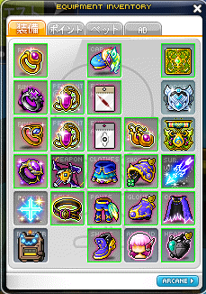

# Stut equipments

| 概要 | 部位 | 強化 | 転生 | 潜在(上/下) | メモ/不満点 |
| :---- | :---- | :---- | :---- | :---- | :---- |
|  | ヴェラ指★17 | 専用書埋め | - | 24% / なし | 雑魚 変えたい |
|^| ヴェラネク★20 | D20合成 専用書埋め | D4, All3% | 30% / 7% | スタフォが気になる 転生が弱い 下潜在もう少し伸ばしたい |
|^| ヴェラネク★20 | D18合成 専用書埋め | All2% | 21% / 4%, A10 | 上潜在を30にしたい |
|^| ヴェラベルト★18 | D18合成 専用書埋め | D24 | 21% / D4%, D4 | 上潜在を30にしたい 下潜在をもう少し伸ばしたい 転生が弱い スタフォ伸ばしたい |
|^| ヴェラ耳★20 | D18合成 専用書埋め | All3% | 24% / 8% | 上潜在を30にしたい |
|^| 200武器★17 | A15合成 15%埋め | S55, A101, Damage4% | Boss70%, Damage9% / A21% | 上の9%をAにしたい 転生が弱い |
|^| 200靴★17 | A6, 30%埋め | D85, All4% | 21% / 4%, A11 | 上潜在を30にしたい |
|^| 200肩★11 | A6, 肯定で埋め(予定) | - | 30% / 6% | 強化終わってない、やれ |
|^| 200手★17 | A6, 30%埋め | D115 | クリダメ8%, D9% / D5%, D14 | 転生もうちょっと伸ばせる？ 下潜在もう少し伸ばしたい |
|^| 200マント★17 | A6, 30%埋め | D48 | 21% / 2%, D10, A10 | 転生改装中 下潜在もう少し伸ばしたい |
|^| 150頭★20 | D合成 肯定埋め | S40, D52, All5% | 21% / A13 | 上潜在を30にしたい 下潜在が弱すぎ |
|^| 150上★20 | D合成 肯定埋め | D48, All4% | 27% / A13 | 下潜在変えたい |
|^| 150下★20 | D合成 肯定埋め | S40, D92 | 21% / A13 | 上潜在を30にしたい |
|^| エンブレム | - | - | A21% / A21% | 上潜在を30にしたい |
|^| 補助武器 | - | - | Boss55%, A9% / Boss12%, A12% | 換装中 |
|^| 魔性指★20 | プレ書埋め | - | 24% / 6% | 上潜在を30にしたい |
|^| マイスタ指★20 | D18合成 プレ埋め(予定) | - | 21% / 9% | 上潜在を30にしたい |
|^| イベント指 | 専用書埋め | - | 30% / なし | スタフォない 弱い |
|^| クロス | - | D65, ALL6% | - | 転生値150ぐらいが欲しいが妥協 |
|^| SW顔★17 | D18合成 プレ書埋め | D56, All4% | 27% / A20 | スタフォ伸ばしたい |
|^| 黒豆目★20 | D13合成 プレ書埋め | S20, D35, All5% | 18% / A11, D17 | アイテムドロを変えたい 下潜在を変えたい |
|^| チタン心臓 | 黒埋め | - | 30% / A10 | 下潜在を伸ばしたい 黒埋めしたい |

# (Order) Enforcement strategy

1. **強化**
最適な書で埋める
2. **スタフォ**
まずは★12にする
強化が終わり次第★17にする
伸ばせそうな目処が立てば★20にする
確率に打ち勝って★22にする
3. **転生**
まずは80ぐらいを目指す
揃えられる程転生の炎が集まれば、120以上を目指す
4. **潜在**
まずはマスミラなどで21%を作る
たまに再販されるヘキサ・ブラックなどで30%を目指す

# (Item) Enforcement strategy

1. **武器/補助武器/エンブレム**
潜在付けるだけの補助武器・エンブレムは優先で良い
2. **変える可能性が低いアクセサリ**
ヴェラッド系、ボスアクセ系など
3. **セット防具**
150防具、アブソ、アーケインなど
4. その他
